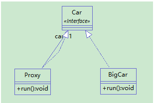
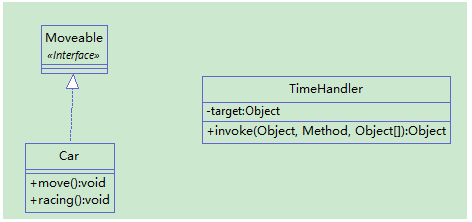
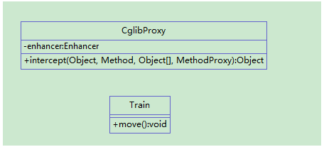

# 介绍

代理模式是一种结构型设计模式， 让你能够提供对象的替代品或其占位符。 代理控制着对于原对象的访问， 并允许在将请求提交给对象前后进行一些处理。

代理模式也是非常常见的一种设计模式，分为静态代理和动态代理。代理模式主要是为了为其它对象提供一种代理以控制这个对象的访问，同时实现一些增强操作。很典型的就是日志操作，Spring的AOP，事务管理等。

## 静态代理



其中的Proxy就是代理类，为BigCar提供代理并实现一些增强操作。

```java
public interface Car {
	void run();
}
```
```java

public class BigCar implements Car {
	@Override
	public void run() {
		// TODO Auto-generated method stub
		System.out.println("老司机开车");
	}
}
```

```java
public class Proxy implements Car {
	private Car car;
	public Proxy(Car car) {
		this.car=car;
	}
	@Override
	public void run() {
		System.out.println("老司机上车啦");
		car.run();
		System.out.println("老司机翻车啦=。=");
	}
}
```

静态代理非常的简单，但我们发现有个问题。比如说我们要为一个接口的所有方法提供代理，增强的方法都一样。这时，这个接口增加了两个方法，这个时候，我们要修改这个接口的所有实现类，这毋庸置疑。但我们同时要改所有代理类，这不利于维护。而且增强的方法都一样，这么做会造成大量重复代码的问题。所以，类臃肿，代码臃肿接踵而至，这么架构明显是非常差劲的。这时，我们就要用到 动态代理了。

## 动态代理

实现动态代理一般有两种办法： JDK和 CGLIB。

先来讲讲JDK自带的动态代理支持。



Moveable是被代理的接口，TimeHandle实现代理方法，它的第一个参数就是接收Moveable实现类对象的。当然还有一个Proxy类没有显示出来，它是用来创建代理类的。

Moveable m = (Moveable)Proxy.newProxyInstance(cls.getClassLoader(), cls.getInterfaces(), h);

它接收了TimeHandle实例。

```java
public interface Moveable {
	void move();
	void racing();
}
```

```java
import java.util.Random;
 
public class Car implements Moveable {
	@Override
	public void move() {
		//实现开车
		try {
			Thread.sleep(new Random().nextInt(1000));
			System.out.println("汽车行驶中....");
		} catch (InterruptedException e) {
			e.printStackTrace();
		}
	}
 
	@Override
	public void racing() {
		// 老司机飙车
		try {
			Thread.sleep(new Random().nextInt(2000));
			System.out.println("老司机飙车中....");
		} catch (InterruptedException e) {
			e.printStackTrace();
		}
	}
}
```

```java

import java.lang.reflect.InvocationHandler;
import java.lang.reflect.Method;
 
public class TimeHandler implements InvocationHandler {
 
	public TimeHandler(Object target) {
		super();
		this.target = target;
	}
 
	private Object target;
	
	/*
	 * 参数：
	 * proxy  被代理对象
	 * method  被代理对象的方法
	 * args 方法的参数
	 * 
	 * 返回值：
	 * Object  方法的返回值
	 * */
	@Override
	public Object invoke(Object proxy, Method method, Object[] args)
			throws Throwable {
		long starttime = System.currentTimeMillis();
		System.out.println("汽车开始行驶....");
		Object object = method.invoke(target, args);
		long endtime = System.currentTimeMillis();
		System.out.println("汽车结束行驶....  汽车行驶时间：" 
				+ (endtime - starttime) + "毫秒！");
//		return null; //move()方法没有返回值 返回null
		
		return object;
	}
}
```

```java
import java.lang.reflect.InvocationHandler;
import java.lang.reflect.Proxy;

public class Client {
	/**
	 * JDK动态代理测试类
	 */
	public static void main(String[] args) {
		Car car = new Car();
		InvocationHandler h = new TimeHandler(car);
		Class<?> cls = car.getClass();
		/**
		 * loader  类加载器
		 * interfaces  实现接口
		 * h InvocationHandler
		 * 想要代理就是要转成父接口
		 */
		Moveable m = (Moveable)Proxy.newProxyInstance(cls.getClassLoader(), cls.getInterfaces(), h);
		m.move();
		m.racing();
	}
}
```

JDK实现方式有一个不足那就是必须提供一个接口，当然我们还有另外一种实现方式，因为代理类只是要实现方法增强，我们可以动态生成一个子类作为代理。

CGLIB（Code Generation Library）帮我们实现了这个想法。



CglibProxy类实现了MethodInterceptor接口，它通过拦截方法来进行代理。使用起来也更简单。他还可以在内部进行判断来选择需要代理的方法。

```java

public class Train {
 
	public void move(){
		System.out.println("火车行驶中...");
	}
	
	public String getCarName() {
		return "奔驰";
	}
}
```

```java
import java.lang.reflect.Method;
 
import net.sf.cglib.proxy.Enhancer;
import net.sf.cglib.proxy.MethodInterceptor;
import net.sf.cglib.proxy.MethodProxy;
 
public class CglibProxy implements MethodInterceptor {
 
	private Enhancer enhancer = new Enhancer();
	
	public Object getProxy(Class clazz){
		//设置创建子类的类
		enhancer.setSuperclass(clazz);
		//设置回调
		enhancer.setCallback(this);
		
		return enhancer.create();
	}
	
	/**
	 * 拦截所有目标类方法的调用
	 * obj  目标类的实例
	 * m   目标方法的反射对象
	 * args  方法的参数
	 * proxy代理类的实例
	 */
	@Override
	public Object intercept(Object obj, Method m, Object[] args,
			MethodProxy proxy) throws Throwable {
		System.out.println("日志开始...");
		//代理类调用父类的方法
		Object object=proxy.invokeSuper(obj, args);//如果该方法返回为void 返回null
		System.out.println("日志结束...");
		return object;
	}
}
```

```java
public class Client {
	/**
	 * @param args
	 */
	public static void main(String[] args) {
 
		CglibProxy proxy = new CglibProxy();
		Train t = (Train)proxy.getProxy(Train.class);
		t.move();
		t.getCarName();
	}
}
```

# 代理模式和装饰器模式的区别

装饰者（decorator）和被装饰者（decoratee）都实现同一个 接口。对代理模式来说，代理类（proxy class）和真实处理的类（real class）都实现同一个接口。他们之间的边界确实比较模糊，两者都是对类的方法进行扩展，具体区别如下：

1. 装饰器模式强调的是增强自身，在被装饰之后你能够在被增强的类上使用增强后的功能。增强后你还是你，只不过能力更强了而已；代理模式强调要让别人帮你去做一些本身与你业务没有太多关系的职责（记录日志、设置缓存）。代理模式是为了实现对象的控制，因为被代理的对象往往难以直接获得或者是其内部不想暴露出来。

2. 装饰模式是以对客户端透明的方式扩展对象的功能，是继承方案的一个替代方案；代理模式则是给一个对象提供一个代理对象，并由代理对象来控制对原有对象的引用；

3. 装饰模式是为装饰的对象增强功能；而代理模式对代理的对象施加控制，但不对对象本身的功能进行增强；