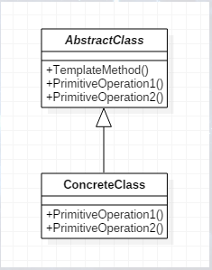
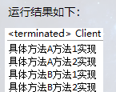
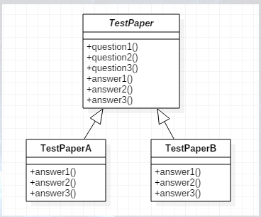
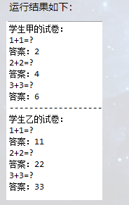

# 定义

所谓模板方法模式，其实很简单，可以从模板的角度考虑，就是一个对模板的应用，就好比老师出试卷，每个人的试卷都是一样的，即都是从老师的原版试卷复印来的，这个原版试卷就是一个模板，可每个人写在试卷上的答案都是不一样的，这就是模板方法模式，是不是很好理解。它的主要用途在于将不变的行为从子类搬到超类，去除了子类中的重复代码。

模板方法模式（TemplateMethod），定义一个操作中的算法的骨架，而将一些步骤延迟到子类中，使得子类可以不改变一个算法的结构即可重定义该算法的某些特定步骤。UML结构图如下：



其中，AbstractClass实现类一个模板方法，定义了算法的骨架，具体子类将重定义PrimitiveOperation以实现一个算法的步骤；而ConcreteClass实现了PrimitiveOperation以完成算法中与特定子类相关的步骤。

## 抽象模板类

定义一个模板方法来组合PrimitiveOperation1()和PrimitiveOperation2()两个方法形成一个算法，然后让子类重定义这两个方法。

```java
public abstract class AbstractClass {

    public abstract void PrimitiveOperation1();
    public abstract void PrimitiveOperation2();

    public void TemplateMethod() {
        PrimitiveOperation1();
        PrimitiveOperation2();
    }

}
```

## 具体模板类

这里定义两个具体模板类，ConcreteClassA及ConcreteClassB来进行测试，继承抽象模板类，实现具体方法。

```java
public class ConcreteClassA extends AbstractClass {

    @Override
    public void PrimitiveOperation1() {
        System.out.println("具体方法A方法1实现");
    }

    @Override
    public void PrimitiveOperation2() {
        System.out.println("具体方法A方法2实现");
    }

}
```

## Client客户端

通过调用模板方法来分别得到不同的结果。

```java
public class Client {

    public static void main(String[] args) {
        AbstractClass abstractClass;

        abstractClass = new ConcreteClassA();
        abstractClass.TemplateMethod();

        abstractClass = new ConcreteClassB();
        abstractClass.TemplateMethod();
    }

}
```



# 应用

1. 何时使用
   - 有一些通用的方法时
2. 方法
   - 将通用算法抽象出来
3. 优点
   - 封装不变部分，扩展可变部分
   - 提取公共部分代码，便于维护
   - 行为由父类控制，子类实现
4. 缺点
   - 每一个不同的实现都需要一个子类实现，导致类的个数增加，使得系统更加庞大
5. 使用场景
   - 有多个子类共有的方法，且逻辑相同
   - 重要的、复杂的方法，可以考虑作为模板方法
   - 重构时，模板方法模式是一个经常使用到的模式，把相同的代码抽取到父类中，通过钩子函数约束其行为
6. 应用实例
   - 做试卷，大家题目都是一样的，只是答案不同
   - 对于汽车，车从发动到停车的顺序是相同的，不同的是引擎声、鸣笛声等
   - 造房时，地基、走线、水管都一样，只有在建筑后期才有差异
7. 注意事项
   - 为防恶意操作，一般模板方法都加上final关键字

# 实现

下面就以上方提到的做试卷为例，具体实现一下以说明如何将模板方法模式应用在实际案例中，UML图如下：



## 试卷抽象类

如下在抽象类中定义三个普通方法代表试卷的问题，再定义三个抽象方法代码试题答案。

```java
public abstract class TestPaper {

    //问题
    public void question1() {
        System.out.println("1+1=?");
        System.out.println("答案：" + answer1());
    }

    public void question2() {
        System.out.println("2+2=?");
        System.out.println("答案：" + answer2());
    }

    public void question3() {
        System.out.println("3+3=?");
        System.out.println("答案：" + answer3());
    }

    //答案
    protected abstract String answer1();

    protected abstract String answer2();

    protected abstract String answer3();
}
```

## 具体试卷

下面定义一个学生甲的试卷，学生乙的试卷与之相比只是返回的答案不同。

```java
public class TestPaperA extends TestPaper {

    @Override
    protected String answer1() {
        return "2";
    }

    @Override
    protected String answer2() {
        return "4";
    }

    @Override
    protected String answer3() {
        return "6";
    }

}
```

## Client客户端

基于同一个模板，学生甲乙分别进行答题，得到不一样的结果。

```java
public class Client {

    public static void main(String[] args) {
        System.out.println("学生甲的试卷：");
        TestPaper studentA = new TestPaperA();
        studentA.question1();
        studentA.question2();
        studentA.question3();

        //分隔符
        System.out.println("------------------------------------------------");

        System.out.println("学生乙的试卷：");
        TestPaper studentB = new TestPaperB();
        studentB.question1();
        studentB.question2();
        studentB.question3();
    }
}
```



当我们要完成在某一细节层次一致的一个过程或一系列步骤，但其个别步骤在更详细的层次上的实现可能不同时，我们通常考虑用模板方法模式来处理。