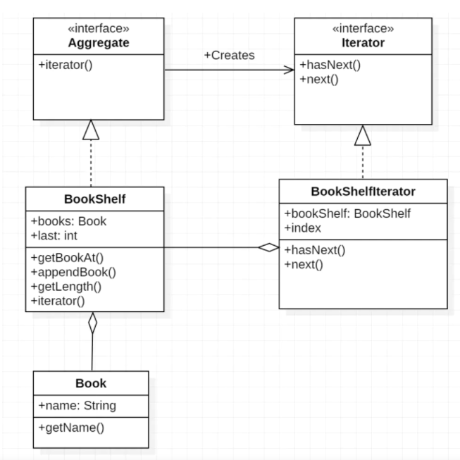
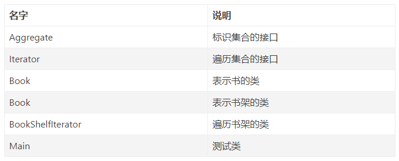
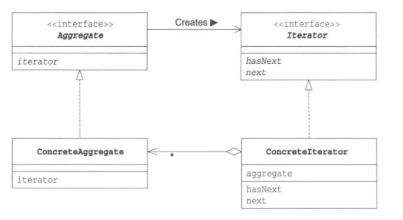

作者：嘟嘟碰碰叮叮当当

链接：https://www.jianshu.com/p/3dd7b4e73561

来源：简书

著作权归作者所有。商业转载请联系作者获得授权，非商业转载请注明出处。

# 定义

迭代器模式（Iterator），提供一种方法顺序访问一个聚合对象中的各种元素，而又不暴露该对象的内部表示。

Java 开发过程中遍历是常用的。如下边程序

```java
public class Demo{
    public static void main(String[] args){
      for(int i =0 ;i<arr.length;i++){
          System.out.println(arr[i]);
      }
    }
}
```

for语句中i++每次循环自增1，迭代到下一元素。将循环变量的作用抽象化，通用化后形成的模式，在设计模式中成为Iterator模式。

# 实现场景
将书（Book）放到书架（BookShelf）中，并将书名按顺序显示。





# 程序示例

## Aggregate 接口

所要便利的集合的接口。实现了该接口的类将成为一个可以保存多个元素的集合，类似数组。

```java
public interface Aggregate{
    public abstract Iterator iterator();
}
```

Aggregate接口中声明的方法为iterator,作用为生成一个用于遍历的迭代器。

## Iterator 接口

作用为遍历集合中元素，相当于循环语句中的循环变量（for(int i =0 ;i<arr.lenth;i++）,具体实现一个顺序遍历的迭代器。

```java
public interface Iterator{
    public abstract boolean hasNext();
    public abstract Object next();
}
```

hasNext() 方法判断是否存在下一个,next()方法获取下一个元素。

特殊说明下，next方法在获取元素的同时，要将计数器向下一个元素的计数加一。获取的是当前元素，并指向下一个元素。

## Book类

普通类，书名field 获取书名的getName()方法。构造函数初始化书名。

```java
public class Book{
    private String name ;
    public Book(String name){
        this.name=name;
    }
    public String getName(){
        return name;
    }
}
```

## BookShelf 类

书架类，作为存放书的集合类，实现Aggregate接口。实现了Aggregate接口的iterator方法。

```java
public class BookShelf implements Aggregate {

    private List<Book> books;


    public BookShelf() {
        this.books = new ArrayList<Book>();
    }

    public Book getBookAt(int index) {
        return books.get(index);
    }

    public void appendBook(Book book) {
        books.add(book);
    }

    public int getLength() {
        return books.size();
    }

    public Iterator iterator() {
        return new BookShelfIterator(this);
    }
}
```

主要点在iterator方法，方法返回了遍历书架时要用的BookShelfIterator类作为书架的迭代器。当外部要遍历书架时会调用该方法。

## BookShelfIterator类

```java
public class BookShelfIterator implements Iterator {

    private BookShelf bookShelf;
    private int index;

    public BookShelfIterator(BookShelf bookShelf) {
        this.bookShelf = bookShelf;
        this.index = 0;
    }

    public boolean hasNext() {
        if (index < bookShelf.getLength()) {
            return true;
        } else {
            return false;
        }
    }


    public Object next() {
        Book book = bookShelf.getBookAt(index);
        index++;
        return book;
    }
}
```

# Main类

```java
public class Main {
    public static void main(String[] args) {
        BookShelf bookShelf = new BookShelf();
        bookShelf.appendBook(new Book("Around the World in 80 Days"));
        bookShelf.appendBook(new Book("Bible"));
        bookShelf.appendBook(new Book("Cinderella"));
        bookShelf.appendBook(new Book("Daddy-Long-Legs"));
        Iterator it = bookShelf.iterator();
        while (it.hasNext()) {
            Book book = (Book) it.next();
            System.out.println(book.getName());
        }
    }
}
```

控制台

```
Around the World in 80 Days
Bible
Cinderella
Daddy-Long-Legs
```

# Iterator模式中各角色的作用

## Iterator(迭代器)
该角色责任定义按顺序逐个遍历元素的接口。
程序中，由Iterator接口扮演，定义了hasNext和next两个方法。

## Concretelterator(具体的迭代器)
该角色负责实现Iterator角色所定义的接口.该角色包含了遍历集合所必须的信息。

## Aggregate(集合)
该角色负责定义创建Iterator角色的接口。这个接口是一个方法会创建出一个，按照顺序访问保存在我内部元素的人。

## ConcreteAggregate(具体集合)
该角色负责实现Aggregate角色所定义的接口。他会创建出具体的Iterator角色，也就是ConcreteIterator,也就是实例中的BookShelf。
Iterator 模式的类图



# 为什么一定要考虑引入Iterator这种复杂的设计模式呢？

如果是数组，直接使用for玄幻语句进行遍历处理不就可以了吗？

为什么要在集合之外引入Iterator角色？

一个重要的理由：引入Iterator后可以将遍历与实现分离开来。

```java
while (it.hasNext()) {
    Book book = (Book) it.next();
    System.out.println(book.getName());
}
```

这里使用了Iterator的hasNext方法和next方法，并没有调用BookShelf的方法。也就是说，这里的while循环并不依赖于BookShelf的实现。

例如在BookShelf的开发人员决定放弃用数组来管理书本，而是用Java.util.Vector取而代之，会怎么样呢。不管BookShelf如何变化，只要BookShelf的iterator方法能正确的返回Iterator的实力，即使不对上面的while循环做任何修改，代码都可以正常工作。

对于BookShelf的调用者来说真的太方便了。

设计模式的作用就是帮助我们编写可复用的类。

所谓可复用，就是指将类实现为组件，当一个组件发生改变时，不需要对其他组件进行修改或是只需要很小的修改即可应对。

这也就能理解为什么在示例程序中iterator方法返回值不是bookshelfiter类而是iter类型了。这表明，程序就是要使用iterator的方法进行编程而不是bookshelfiterator的方法。


