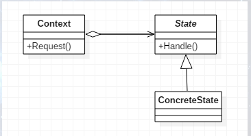
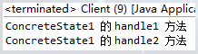
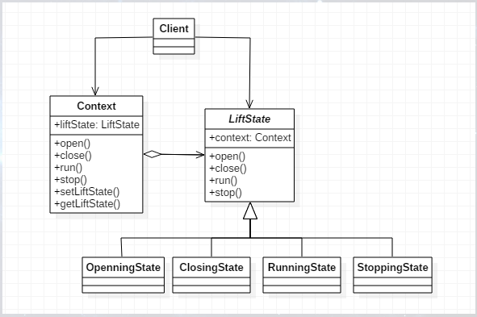
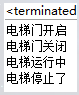
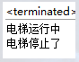

# 什么是状态模式

状态这个词汇我们并不陌生，在日常生活中，不同时间就有不同的状态，早上起来精神饱满，中文想睡觉，下午又渐渐恢复，晚上可能精神更旺也可能耗费体力只想睡觉，这一天中就对应着不同的状态。或者对软件开发人员更形象的描述可能是UML的状态图（即用于描述一个实体基于事件反应的动态行为，显示了该实体如何根据当前所处的状态对不同的事件做出反应）。
   
其实相对来说，就是一种状态的变化，而状态模式主要解决的问题就是当控制一个对象状态转换的条件表达式过于复杂时的情况。即把状态的判断逻辑转移到标识不同状态的一系列类当中。

状态模式（State），当一个对象的内在状态改变时允许改变其行为，这个对象看起来像是改变了其类。UML结构图如下：



其中，Context类为环境角色，用于维护一个ConcreteState子类的实例，这个实例定义当前的状态；State为抽象状态角色，定义一个接口以封装与Context的一个特定接口状态相关的行为；ConcreteState是具体状态角色，每一个子类实现一个与Context的一个状态相关的行为。

## Context类

环境角色具有两个职责，即处理本状态必须完成的任务，及决定是否可以过渡到其它状态。对于环境角色，有几个不成文的约束：

- 即把状态对象声明为静态常量，有几个状态对象就声明几个状态常量
- 环境角色具有状态抽象角色定义的所有行为，具体执行使用委托方式

```java
public class Context {

    //定义状态
    public final static State STATE1 = new ConcreteState1();
    public final static State STATE2 = new ConcreteState2();

    //当前状态
    private State currentState;

    //获得当前状态
    public State getCurrentState() {
        return currentState;
    }

    //设置当前状态
    public void setCurrentState(State currentState) {
        this.currentState = currentState;
//        System.out.println("当前状态：" + currentState);
        //切换状态
        this.currentState.setContext(this);
    }

    public void handle1() {
        this.currentState.handle1();
    }
    public void handle2() {
        this.currentState.handle2();
    }

}
```

## State抽象状态类

抽象环境中声明一个环境角色，提供各个状态类自行访问，并且提供所有状态的抽象行为，由各个实现类实现。

```java
public abstract class State {

    protected Context context;
    public void setContext(Context context) {
        this.context = context;
    }

    //行为1
    public abstract void handle1();
    //行为2
    public abstract void handle2();

}
```

## 具体状态

```java
public class ConcreteState1 extends State {

    @Override
    public void handle1() {
        //...
        System.out.println("ConcreteState1 的 handle1 方法");
    }

    @Override
    public void handle2() {
        super.context.setCurrentState(Context.STATE2);
        System.out.println("ConcreteState1 的 handle2 方法");
    }
}
```

## Client客户端

定义Context环境角色，初始化具体状态1，执行行为观察结果。

```java
public class Client {

    public static void main(String[] args) {
        //定义环境角色
        Context context = new Context();
        //初始化状态
        context.setCurrentState(new ConcreteState1());
        //行为执行
        context.handle1();
        context.handle2();
    }
}
```

运行结果如下：



从运行结果可见，我们已经隐藏了状态的变化过程，它的切换引起了行为的变化。对外来说，我们只看到了行为的改变，而不用知道是状态变化引起的。

如果还是有点不理解的话，参考一下下方第三部分的内容，状态模式的具体实例即可。

# 状态模式的应用

1. 何时使用
    - 代码中包含大量与对象状态有关的条件语句
2. 方法
    - 将各种具体的状态类抽象出来
3. 优点
    - 结构清晰，避免了过多的switch…case或if…else语句的使用
    - 很好的体现了开闭原则和单一职责原则，想要增加状态就增加子类，想要修改状态就修改子类即可
    - 封装性非常好，状态变化放置到了类的内部来实现，外部调用不需要知道类内部如何实现状态和行为的变换
4. 缺点
    - 子类会太多，也即类膨胀
5. 使用场景
    - 行为随状态改变而改变的场景
    - 条件、分支判断语句的替代者
6. 应用实例
    - 电梯，有运行状态、开门状态、闭门状态、停止状态等
    - 一日从早到晚自身的状态，比如工作状态、学习状态等等
    - 运动员可以有正常状态、非正常状态和超长状态
7. 注意事项
    - 在行为受状态约束的情况下可以使用状态模式，使用时对象的状态最好不要超过5个
    
# 状态模式的实现

我们经常坐电梯都知道，电梯有多种状态，就按最简单的来说，包括运行状态、停止状态、开门状态、闭门状态。下面就以电梯运行为例，举一个具体的实例，UML图如下：



## 环境角色Context

首先定义出电梯的所有状态，然后定义当前电梯状态，再定义四种状态对应的方法，如Openning状态是由open()方法产生的。至于这些方法中的逻辑，就用print来代替了。

```java
public class Context {

    //定义出电梯的所有状态
    public final static LiftState OPENNING_STATE = new OpenningState();
    public final static LiftState CLOSING_STATE = new ClosingState();
    public final static LiftState RUNNING_STATE = new RunningState();
    public final static LiftState STOPPING_STATE = new StoppingState();

    //定义一个当前电梯状态
    private LiftState liftState;

    public LiftState getLiftState() {
        return liftState;
    }

    public void setLiftState(LiftState liftState) {
        this.liftState = liftState;
        //通知到各个实现类中
        this.liftState.setContext(this);
    }

    public void open() {
        this.liftState.open();
    }

    public void close() {
        this.liftState.close();
    }

    public void run() {
        this.liftState.run();
    }

    public void stop() {
        this.liftState.stop();
    }
}
```

## 抽象电梯状态LiftState

这里我们定义并把Context这个环境角色聚合进来，并传递到子类。所以我们可以这样理解，Context环境角色的作用就是串联各个状态的过渡，也就是在4个具体的实现类中，各自根据自己的环境来决定如何进行状态的过渡。

```java
public abstract class LiftState {

    protected Context context;

    public void setContext(Context context) {
        this.context = context;
    }

    //电梯门开启动作
    public abstract void open();
    //电梯门关闭动作
    public abstract void close();
    //电梯运行
    public abstract void run();
    //电梯停止
    public abstract void stop();

}
```

## 电梯开门状态

对于开门状态，除去自身的开启电梯门的方法之外，在打开门之后应该还具备关闭电梯门的功能，而门开着的时候是不能运行也不能停止的。

```java
public class OpenningState extends LiftState {

    //执行打开电梯门方法
    @Override
    public void open() {
        System.out.println("电梯门开启");
    }

    //打开后还可以关闭电梯门
    @Override
    public void close() {
        //状态修改
        super.context.setLiftState(Context.CLOSING_STATE);
        //动作委托为CLOSING_STATE执行
        super.context.getLiftState().close();
    }

    //门开着不能运行
    @Override
    public void run() {
        //什么都不做
    }

    //门开着已经停止了
    @Override
    public void stop() {
        //什么都不做
    }

}
```

## 电梯闭门状态

对于闭门状态，除去自身外，电梯门关闭之后还可以再度打开，所以有open()方法；而门关了之后是可以运行的，所以有run()方法；如果关了门没有按楼层的话，此时电梯处于停止状态，所以有stop()方法。

```java
public class ClosingState extends LiftState {

    //电梯门关了可以再开
    @Override
    public void open() {
        //置为敞门状态
        super.context.setLiftState(Context.OPENNING_STATE);
        super.context.getLiftState().open();
    }

    // * 执行电梯门关闭方法
    @Override
    public void close() {
        System.out.println("电梯门关闭");
    }

    //电梯门关了就运行
    @Override
    public void run() {
        super.context.setLiftState(Context.RUNNING_STATE);
        super.context.getLiftState().run();
    }

    //电梯门关了但没有按楼层
    @Override
    public void stop() {
        super.context.setLiftState(Context.STOPPING_STATE);
        super.context.getLiftState().stop();
    }
}
```

## 电梯运行状态

```java
public class RunningState extends LiftState {

    //运行时不能开门
    @Override
    public void open() {
        //什么都不做
    }

    //运行时门肯定是关的
    @Override
    public void close() {
        //什么都不做
    }

    // * 执行运行方法
    @Override
    public void run() {
        System.out.println("电梯运行中");
    }

    //运行后可以停止
    @Override
    public void stop() {
        //环境设置为停止状态
        super.context.setLiftState(Context.STOPPING_STATE);
        super.context.getLiftState().stop();
    }

}
```

## 电梯停止状态

当电梯处于停止状态时，门是关闭着的，所以不能执行关门的方法；但此时是可以开门的；而停止后电梯也可以再度运行，所以存在run()方法。

```java
public class StoppingState extends LiftState {

    //停下了要开门
    @Override
    public void open() {
        super.context.setLiftState(Context.OPENNING_STATE);
        super.context.getLiftState().open();
    }

    //门本来就是关着的
    @Override
    public void close() {
        //什么都不做
    }

    //停止后可以再运行
    @Override
    public void run() {
        super.context.setLiftState(Context.RUNNING_STATE);
        super.context.getLiftState().run();
    }

    //执行停止方法
    @Override
    public void stop() {
        System.out.println("电梯停止了");
    }

}
```

## Client客户端

这里假设初始状态为闭门状态，大家可以自行尝试其它初始值。

```java
public class Client {

    public static void main(String[] args) {
        Context context = new Context();

        //定义初始状态为关门（共四种初始值）
        context.setLiftState(new ClosingState());
        context.open();
        context.close();
        context.run();
        context.stop();
    }

}
```

运行结果如下：



如果将setLiftState()方法的参数换成运行状态，即 `context.setLiftState(new RunningState());` ，运行结果如下：



可以发现，此时电梯处于运行中，open()方法和close()方法都是无效的。

如果不用状态模式实现的话，常用的方法是在每个方法中使用switch语句来判断当前状态进行处理，而使用状态模式，通过各个子类来实现，避免了switch语句的判断，使得代码看起来不是那么的冗杂。那么结合状态模式的特点，如果现在要增加两个状态即通电状态和断点状态呢？其实很简单，只需增加两个子类，并在原有类上增加而不是去修改，符合开闭原则；而这里我们的状态都是单独的类，只有与这个状态有关的因素修改了，这个类才修改，符合迪米特法则。