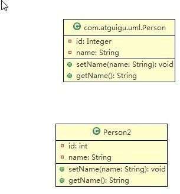
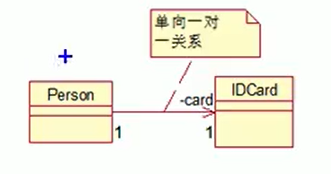
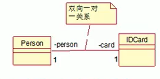
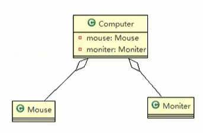

# UML类图

- 用于描述系统中的类（对象）本身组成和类（对象）之间的各种静态关系。
- 类之间的关系：**依赖、泛化（继承）、实现、关联、聚合、组合**

# 类图的简单举例

针对下面的Person类绘制出类图

```java
public class Person {
    private Integer id;
    private String name;

    public void setName(String name) {
        this.name = name;
    }

    public String getName() {
        return name;
    }
}
```
绘制出的类图如下：



## 类图-依赖关系

只要是在类中用到了对方，那么他们之间就存在依赖关系，如果没有对方，连编译都通过不了。

```java
public class PersonServiceBean {
    private PersonDao personDao;

    public void save(Person person) {
    }

    public IDCard getIDCard(Integer personId) {
        return null;
    }

    public void modify() {
        Department department = new Department();
    }
}
```

## 类图-泛化关系(继承)

泛化关系实际上就是继承关系，他是**依赖关系的一种特例**。

```java
public class PersonServiceBean extends DaoSupport {

}

abstract class DaoSupport {
    void save(Object entity) {
    }

    void delete(Object entity) {
    }
}
```

## 类图-实现关系（接口实现）

实现关系实际上就是A类实现了B类，他是**依赖关系的特例**。


## 类图-关联关系

关联关系实际上就是类与类之间的联系，**他是依赖关系的特例**。

关联关系具有导航性，即双向关系或者单向关系。

关联关系具有多重性，如“1”（表示有且仅有一个），“0...”（表示0个或者多个），“0,1”（表示0个或者1个），“n...m”（表示n到m个都可以），“m...”（表示至少m个）

- 单向一对一关系

```java
public class Person{
    private IDCard card;
}

public class IDCard{}
```

类图：



- 双向一对一关系

```java
public class Person{
    private IDCard card;
}

public class IDCard{
    private Person person;
}
```

类图：



## 类图-聚合关系

聚合关系表示的是整体和部分的关系，整体与部分可以分开。**聚合关是关联关系的特例**，所以它具有关联的导航性与多重性。

如：一台电脑由键盘、显示器、鼠标等组成；组成电脑的各个配件是可以 从电脑上分离出来的，使用带空心的菱形的实线表示。

如果鼠标、显示器和电脑是不可以分离的，则升级为组合关系。



## 类图-组合关系

组合关系：也就是整体与部分的关系，但是整体与部分是不可以分离的。

在看一个案例：在程序中我们定义实体：Person与IDCard、Head，那么Head和Person就是组合关系，IDCard和Person就是聚合关系。

但是如果在程序中Person实体中定义了对IDCard进行级联删除，即删除了Person时连同IDCard一起删除，那么IDCard和Person就是组合了。