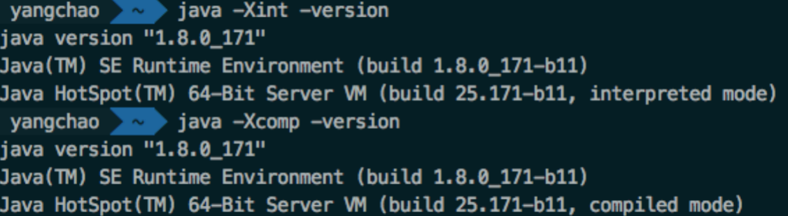
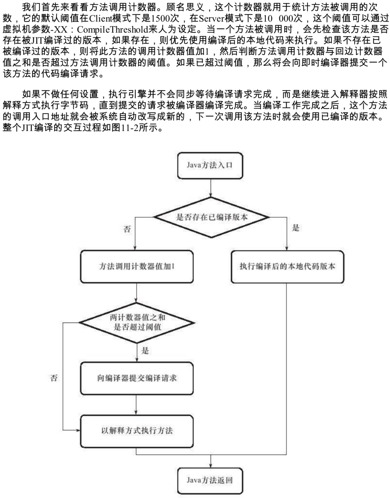
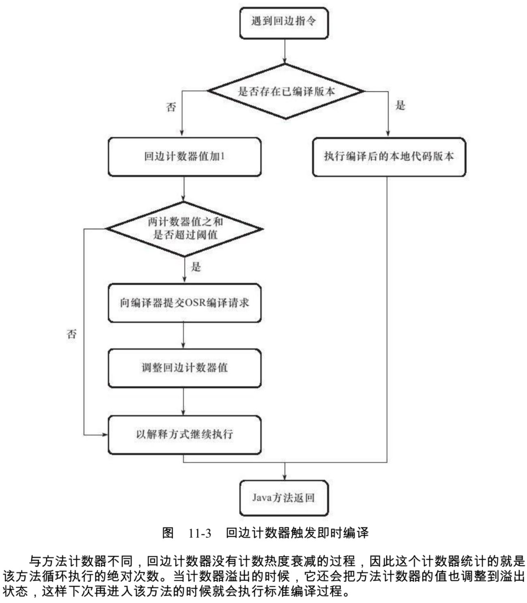
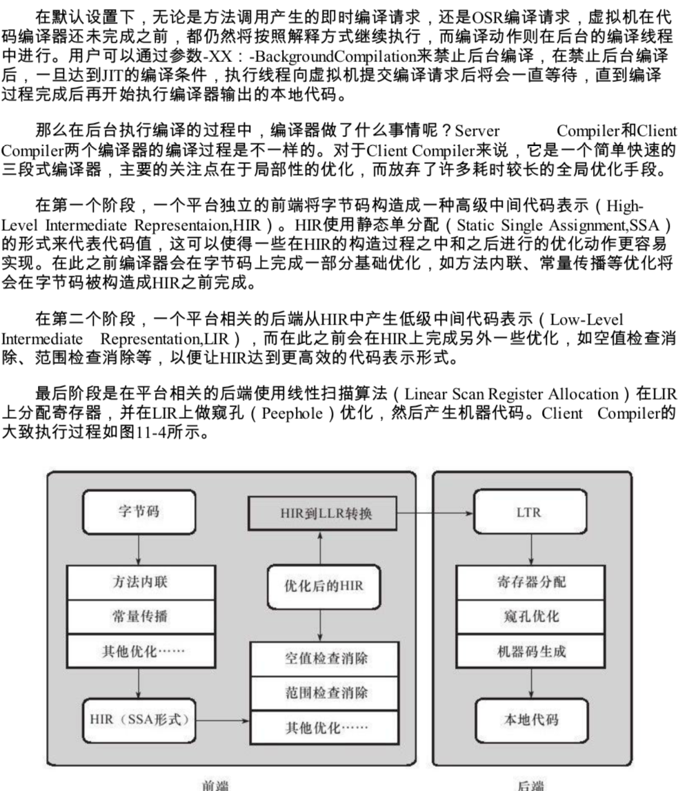
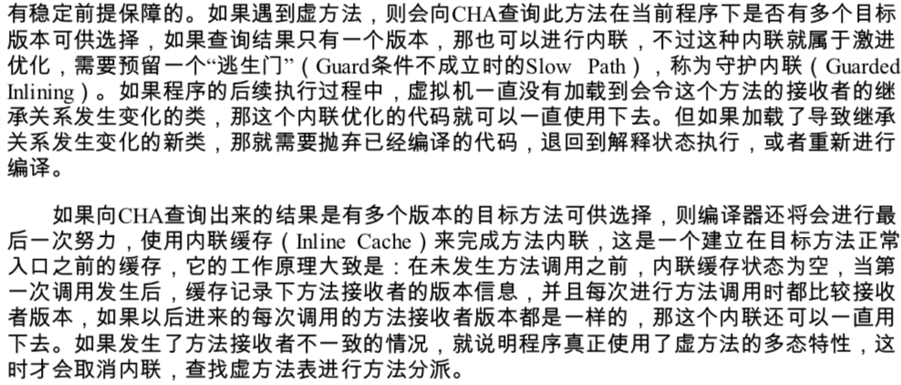
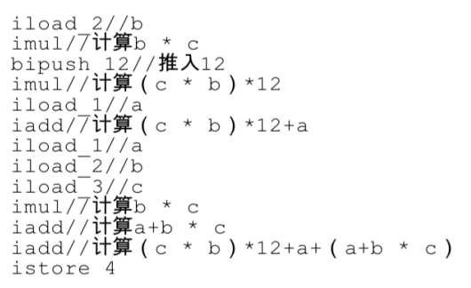
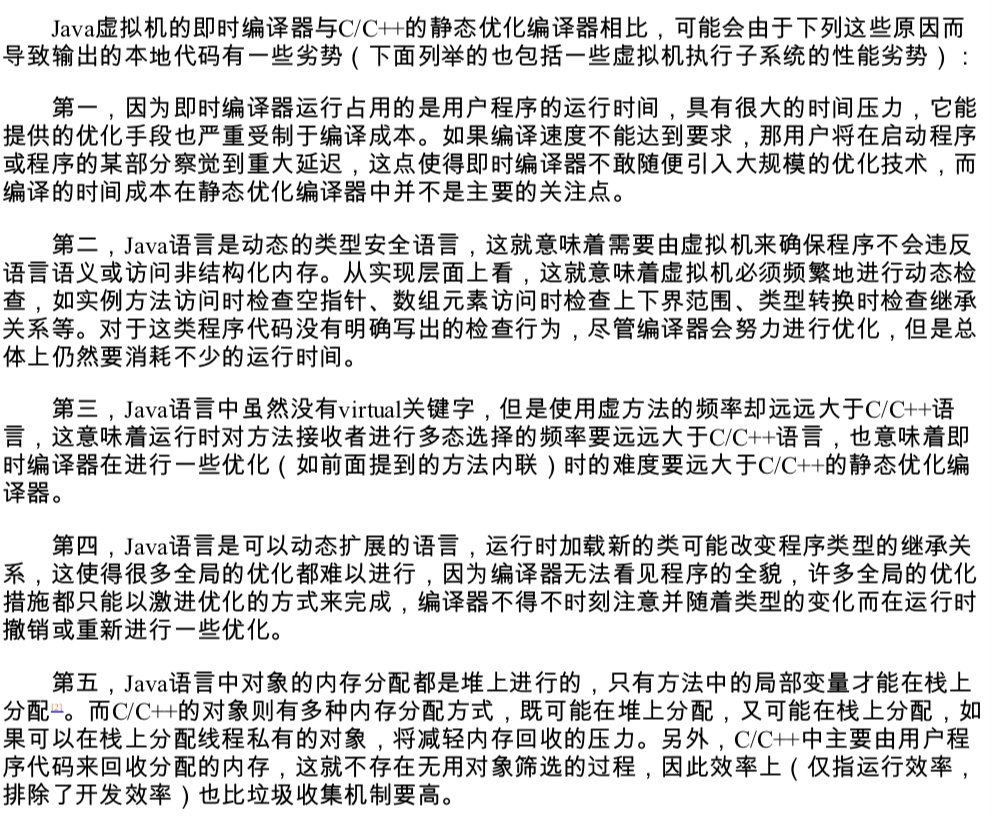

转载：https://www.cnblogs.com/blogtech/p/10015474.html

https://blog.csdn.net/u012834750/article/details/79488572

# 概述

在部分的商用虚拟机（Sun HotSpot）中，Java程序最初是通过解释器（Interpreter）进行解释执行的，当虚拟机发现某个方法或代码块运行的特别频繁时，就会把这些代码认定为“热点代码”（Hot Spot Code）。

为了提高热点代码的执行效率，在运行时，虚拟机将会把这些热点代码编译成与本地代码相关的机器码，并进行各种层次的优化，完成这个任务的编译器称为即时编译器（Just In Time Compiler，下文中简称JIT编译器）。

即时编译器并不是虚拟机必须的部分，Java虚拟机规范并没有规定Java虚拟机内必须要有即时编译器存在，更没有规定或指导即时编译器应该如何去实现。

但是，即时编译器编译性能的好坏、代码优化程度的高低却是衡量一款商用虚拟机优秀与否的最关键的指标之一，它是虚拟机中最核心且最能体现虚拟机技术水平的部分。

# HotSpot 虚拟机内的即时编译器

## 解释器与编译器

尽管并不是所有的Java虚拟机都采用解释器与编译器并存的架构，但许多主流的商用虚拟机，如HtoSpot，J9等，都同时包含解释器与编译器。

解释器与编译器两者各有优势：**当程序需要迅速启动和执行的时候，解释器可以首先发挥作用，省去编译的时间，立即执行**。在程序运行后，**随着时间的推移，编译器逐渐发挥作用，把越来越多的代码编程成本地代码之后，获取更搞得执行效率**。当程序运行环境中内存资源限制较大，**可以使用解释器执行节约内存，反之可以使用编译执行来提升效率**。

同时，解释器还可以作为编译器进行优化时的一个“逃生门”，让编译器根据概率选择一些大多数时候都能提升运行速度的优化手段，当激进优化的假设不成立，如加载了新类后类型继承结构出现变化、出现了“罕见陷阱”时可以通过逆优化退回到解释状态继续执行（部分没有解释器的虚拟机中也会采用不进行激进优化的C1编译器--担任“逃生门”的角色）。

因此，在整个虚拟机执行架构中，解释器与编译器经常配合工作，如图所示：


HotSpot虚拟机中内置有两个即时编译器，分别称为**Client Compiler和Server Compiler**，或者简称为**C1编译器和C2编译器**。

目前主流的HotSpot虚拟机中，默认采用解释器与其中一个编译器直接配合的方式工作，程序使用哪个编译器，取决于虚拟机运行模式，HotSpot虚拟机会根据自身版本与宿主机器的硬件性能自动选择运行模式，用户也可以使用“-client”或“-server”参数指定虚拟机运行在Client模式或Server模式。

虚拟机默认采用“混合模式”进行Java代码编译后执行，可以使用 -Xint优先采用解释器解释执行；使用-Xcomp 优先采用即时编译器编译执行，但是解释器仍然要在编译无法进行的情况下介入执行过程。



由于即时编译器编译本地代码需要占用程序运行时间，要编译出优化程度更高的代码，所花费的时间可能更长；而且想要编译出优化程度更高的代码，解释器可能还要替编译器收集性能监控信息，这对解释执行的速度也有影响。

为了在程序启动响应速度与运行效率之间达到最佳平衡，HotSpot虚拟机还会逐渐启动分层编译的策略，分层编译根据编译器编译、优化的规模与耗时，划分出不同的编译层次，其中包括：

- 第0层，程序解释执行，解释器不开启性能监控功能（Profiling），可触发第1层编译。
- 第1层，也称为C1编译，将字节码编译为本地代码，进行简单、可靠的优化，如有必要将加入性能监控的逻辑；
- 第2层，也称为C2编译，也是将字节码编译为本地代码，但是会启用一些编译耗时较长的优化，甚至会根据性能监控信息进行一些不可靠的激进优化。

实施分层编译后，Client Compiler和Server Compiler将同时工作，许多代码都可能会被多次编译，**用Client Compiler获取更高的编译速度，用Server Compiler获取更好的编译质量**，在解释执行的时候也无需再承担收集性能监控信息的任务。

## 编译对象和触发条件

上文中提到过，在运行过程中会被即时编译器编译的“热点代码”有两类：

- 1）被多次调用的方法；
- 2）被多次执行的循环体；

对于第一种情况，由于是由方法调用触发的编译，因此编译器理所当然地会以整个方法作为编译对象，这种编译也是虚拟机中标准得JIT编译方法。

而对于后一种情况，尽管编译动作由循环体所触发的，但编译器依然会以整个方法（而不是单独的循环体）作为编译对象。这种编译方式因为**编译发生在方法执行的过程中**，因此形象的称之为**栈上替换**（On Stack Replacement，简称OSR编译，即方法栈帧还在栈上，方法就被替换了）。

**基于采样的热点探测（Sample Based Hot Spot Detection）**：采用这种方法的虚拟机会周期性地检测各个线程的栈顶，如果发现某个（或某些）方法经常出现在栈顶，那这个方法就是“热点方法”。基于采样的热点探测的好处是实现简单、高效、还可以很容易地获取方法调用关系，缺点就是很难精确地确认一个方法的热度，容易因为受到线程阻塞或别的外界因素的影响而扰乱热点探测；

**基于计数器的热点探测（Counter Based Hot Spot Detection）**：采用这种方法的虚拟机会为每个方法（甚至是代码块）建立计数器，统计代码的执行次数，如果执行次数超过一定的阈值就认为它是“热点方法”。这种统计方法实现起来麻烦一些，需要为每个方法建立并维护计数器，而且不能直接获取到方法的调用关系，但是它的统计结果相对来说更加精确和严格！

**在HotSpot虚拟机中使用的第二种---基于计数器的热点探测方法**，因此它为每个方法准备了两类计数器：**方法调用计数器（Invocation counter）和回边计数器（Back Edge counter）**。当计数器超过阈值溢出了，就会触发JIT编译。

**方法调用计数器（Invocation counter）**:



回边计数器：它的作用是统计一个方法中循环体代码执行的次数，在字节码中遇到控制流向后跳转的指令称为”回边“。目的就是为了触发OSR编译。

默认在Client模式下，回边计数器的阈值是13995；在Server模式下的阈值是10700。



## 编译过程



而Server Compiler则是专门面向服务端的典型应用并为服务端的性能配置特别调整过的编译器，它执行所有经典的优化动作，如无用代码消除、循环展开、常量传播等。以即时编译器的标准来看，Server Compiler无疑是比较缓慢的，但它的编译速度依然远远超过传统的静态优化编译器，而且它相对于Client Compiler编译输出的代码质量有所提高，可以减少本地代码的执行时间，从而抵消了额外的编译时间开销，所以也有很多非服务端的应用选择使用Server模式的虚拟机运行。

# 编译优化技术

Java程序员有一个共识，以编译方式执行本地代码比解释方式更快，之所以有这样的共识，除去虚拟机解释执行字节码时额外消耗时间的原因外，还有一个很重要的原因就是虚拟机设计团队几乎把代码的所有优化措施都集中在了即时编译器之中，因此一般来说，即时编译器生成的本地代码比Javac产生的字节码更加优秀。

## 方法内联优化

方法内联具有很高的重要性，一是去除方法调用的成本（如建立栈帧等），二是为了其他优化建立良好的基础。

**注意：方法的调用过程发生的时期？**

- (1) 首先会有个执行栈，存储目前所有活跃的方法，以及它们的本地变量和参数；
- (2) 当一个新的方法被调用了，一个新的栈帧会被加到当前线程的栈顶，分配的本地变量和参数会存储在这个栈帧中；
- (3) 跳到目标方法代码执行；
- (4) 方法返回的时候，本地方法和参数会被销毁，栈顶被移除；
- (5) 返回原来地址执行；

### 方法内联的原理

**方法内联就是把被调用方函数代码”复制”到调用方函数中，来减少因函数调用开销的技术。**

我们写一个简单的两数相加程序，被内联前的代码：

```java
private int add1(int a, int b, int c, int d){
      return add2(a + b) + add2(c + d);
  }
 
  private int add2(int x, int y){
      return x + y;
}
```

运行一段时间后JVM会把add2方法去掉，并把你的代码翻译成：

```java
private int add1(int a, int b, int c, int d){
    return a + b + c + d;
}
```

1）方法内联的其他隐含条件：

- 虽然JIT号称可以针对代码全局的运行情况而优化，但是JIT对一个方法内联之后，还是可能因为方法被继承，导致需要类型检查而没有达到性能的效果
- 想要对热点的方法使用上内联的优化方法，最好尽量使用final、private、static这些修饰符修饰方法，避免方法因为继承，导致需要额外的类型检查，而出现效果不好情况。

2）如果想要知道方法被内联的情况，可以使用下面的JVM参数来配置：

- -XX:+PrintCompilation //在控制台打印编译过程信息
- -XX:+UnlockDiagnosticVMOptions //解锁对JVM进行诊断的选项参数。默认是关闭的，开启后支持一些特定参数对JVM进行诊断
- -XX:+PrintInlining //将内联方法打印出来

3）编译器在进行内联时，如果是非虚方法，那么直接进行内联就可以了，这时候的内联是有稳定前提保障的。（虚方法即为子类继承/实现父类，重写的方法）



## 优化技术

1）优化前的原始代码：

```java
public class B{
    int value;
 
    final int get(){
        return value;
    }   
 
    public void foo(){
        y = b.get();
        //......do stuff......
        y = b.get();
        sum = y + z;
    }   
}
```

2）内联后的代码：

```java
public void foo(){
    y = b.value
    //......do stuff......
    z = b.value
    sum = y + z;
}
```

3）冗余diaman存储消除的代码：

```java
public void foo(){
    y = b.value
    //......do stuff......
    z = y
    sum = y + z;
}
```

把”z=b.value”替换为”z=y“,因为上一句”y=b.value“已经保证了变量y和b.value是一致的，这样就可以不再去访问对象b的局部变量了。

4）复写传播代码：

```java
public void foo(){
    y = b.value
    //......do stuff......
    y = y
    sum = y + y;
}
```

5）进行无用代码消除：

```java
public void foo(){
    y = b.value
    //......do stuff......
    sum = y + y;
}
```

## 公共子表达式消除

如果一个表达式E已经计算过了，并且从先前的计算到现在E中所有变量的值都没有发生变化，那么E的这次出现就成为了公共子表达式。

例如：`int d = (c + b) * 12 + a + (a + b * c);`

1）代码交给Javac编译器则不会进行任何优化：（Javac编译器编译后的字节码展示）



2）代码进入即时编译器JIT中：

`int d = E * 12 + a + (a + E);`

3）这时即时编译器有可能进行另外一种优化：代数简化

`int d = E * 13 + a * 2;`

## 数组边界检查消除

Java语言是一门动态安全的语言。如果有一个数组foo[]，在Java语言中访问数组元素foo[i]的时候系统将会自动进行上下界的范围检查，即检查i必须满足`i >=0 && i < foo.length`这个条件，否则将抛出一个运行时异常：`java.lang.ArrayIndexOutOfBoundsException`。

无论如何，为了安全，数组便捷检查肯定是必须做的，但数组边界检查是不是必须在运行期间一次不漏的检查则是可以“商量”的事情。例如：数组下标是一个常量，如 foo[3]，只要在编译期根据数据流分析来确定foo.length的值，并判断下标“3”没有越界，执行的时候就无需判断了。

## 逃逸分析

逃逸分析的基本行为就是分析对象动态作用域：当一个对象在方法中被定以后，它可能被外部方法所引用，例如作为调用参数传递到其他方法中，称为方法逃逸。

甚至还有其可能被外部线程访问到，譬如赋值给类变量或可以在其他线程中访问的实例变量，称为线程逃逸。

# Java编译器和C/C++的编译器相对

